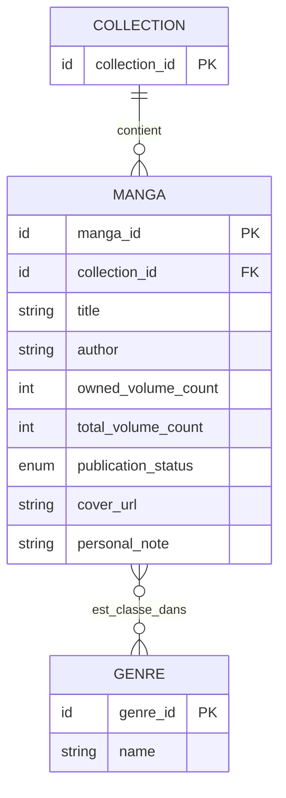

# Modèle de données

Ce modèle décrit les données métier conservées localement par l'application, conformément au cahier des charges (`specifications.md`). Une seule collection personnelle est gérée ; aucun compte utilisateur ni synchronisation distante n'est prévu.

## Entités

### Collection

La collection est l'agrégat racine des mangas possédés. Il n'en existe qu'une par installation de l'application.

| Attribut | Type | Obligatoire | Description |
| --- | --- | --- | --- |
| `collection_id` | Identifiant | Oui | Identifiant interne de la collection. |

### Manga

Une entrée décrit un manga de la collection. Les données provenant du catalogue public sont des suggestions : elles ne sont conservées qu'après validation et enregistrement par l'utilisateur.

| Attribut | Type | Obligatoire | Description |
| --- | --- | --- | --- |
| `manga_id` | Identifiant | Oui | Identifiant interne de l'entrée. |
| `collection_id` | Identifiant | Oui | Collection à laquelle l'entrée appartient. |
| `title` | Texte | Oui | Titre du manga ; ne peut pas être vide. |
| `author` | Texte | Non | Auteur, si connu. |
| `owned_volume_count` | Entier ≥ 0 | Oui | Nombre de volumes possédés. |
| `total_volume_count` | Entier ≥ 0 | Non | Nombre total de volumes publiés ou prévus ; `null` si inconnu. |
| `publication_status` | Énumération | Oui | Statut de publication : `in_progress`, `completed` ou `unknown`. |
| `cover_url` | URL | Non | Adresse de la jaquette, si disponible. |
| `personal_note` | Texte | Non | Note personnelle libre. |

L'absence d'une valeur facultative est distincte d'une valeur numérique égale à zéro.

### Genre

Un genre est une valeur réutilisable pouvant être associée à plusieurs mangas.

| Attribut | Type | Obligatoire | Description |
| --- | --- | --- | --- |
| `genre_id` | Identifiant | Oui | Identifiant interne du genre. |
| `name` | Texte | Oui | Libellé du genre. |

## Relations et règles métier

- La collection unique contient zéro ou plusieurs mangas ; chaque manga appartient à cette collection.
- Un manga peut avoir zéro, un ou plusieurs genres. Un genre peut être associé à zéro ou plusieurs mangas.
- Le titre d'un manga est obligatoire et ne peut pas être vide.
- Le nombre de volumes possédés est un entier supérieur ou égal à zéro.
- Le nombre total de volumes et les autres informations facultatives peuvent être absents lorsqu'ils sont inconnus ou indisponibles.
- Le statut de publication prend l'une des valeurs `in_progress` (en cours), `completed` (terminé) ou `unknown` (inconnu).
- La suppression d'un manga le retire de la collection et de ses associations aux genres.

## Diagramme

Les résultats de recherche du catalogue sont des suggestions temporaires et ne constituent pas des données persistées tant que l'utilisateur n'a pas créé une entrée. Le fichier CSV est une représentation exportée de la collection, pas une entité métier supplémentaire.
